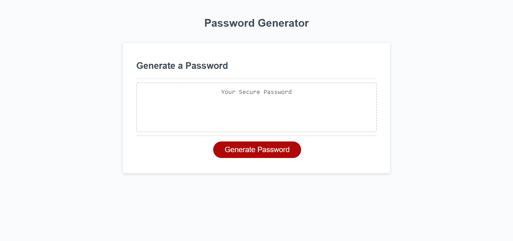

# password-generator
Browser application that creates a randomly generated password according to user's specifications.

This project is a password generator that runs in the browser. Extrapolated from HTML/CSS starter code.

[Project Links]

Deployed application: https://balokdecoy.github.io/password-generator/ 

Github repo: https://github.com/balokdecoy/password-generator 

[Project Screenshots]

[User Instructions and Program Logic]

User clicks the Generate Password button and responds to a series of prompts and confirmations to set password specifications. 

User enters a number no less than 8 and no greater than 128 to set the length of the password. 

User is asked to confirm whether they would like numbers, special characters, lowercase letters, and/or uppercase letters in the password. 

User selections are concatenated to a password array. 

Program loops through the modified password array as many times as the password length request, pulling a random character from the array each time. 

Compiled password is displayed in the text box. 

[Input Validation]

If user selects a number less than 8 or greater than 128, or enters a character that is not a number, they are alerted to select a valid number and text box displays the same message. 

If user selects a valid number but enters false for all of the password parameters, user is alerted to select at least one password element and text box displays the same message.

Once the user successfully runs the program and is given a password, the password array is reset so the user can rerun the program with a fresh password array without having to refresh the page. This refresh can be seen in the console log at line 120 after running the program. 

[Acknowledgments]

The HTML and CSS are starter code provided by GWU. Project goal entails fleshing out the Javascript file with appropriate logical conditions and events to write password text to the HTML text box. 

Thanks to Gabe Perry for clarification on the for loop structure and concat() function. 

Thanks to Saveliy Samoylov for feedback and clarification on true/false conditions in user inputs. 

Thanks to Amir Ashtiany, Young Ji Kim, Beatrice Ellingson, and Frankie Rosado for their feedback, support, and brainstorming. Visit their Github pages here: 

1. Amir Ashtiany - https://github.com/Alexfit4 
2. Young Ji Kim - https://github.com/youjmi 
3. Beatrice Ellingson - https://github.com/beatricellingson 
4. Frankie Rosado - https://github.com/Franciscorosado09  